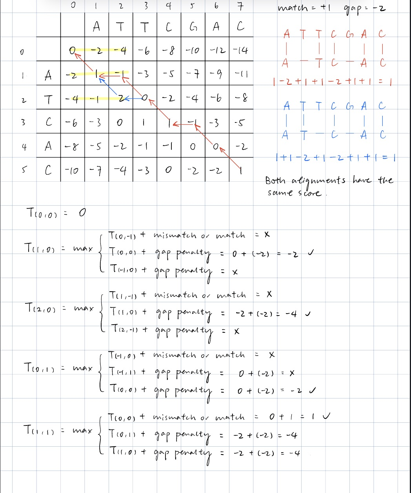
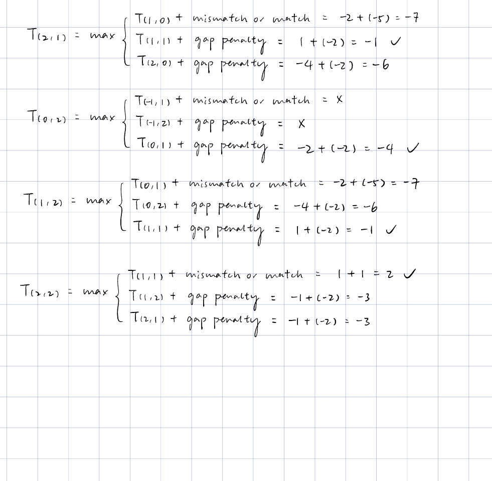

---
title: "Theo's version"
author: "Theo-60985751, Hannah- , Jingxuan-"
date: "2023-11-18"
output: html_document
---

```{r setup, include=FALSE}
knitr::opts_chunk$set(echo = TRUE)
```

# Q1. Sequencing technologies

Areas of the genome with high GC content are harder to sequence because these 
regions coil up to themselves and require energy to separate them into straight
strands that can finally be PCR-ed/sequenced. 
Source: https://www.neb.com/en/nebinspired-blog/four-tips-for-pcr-amplification
-of-gc-rich-sequences#:~:text=Why%20can%20these%20regions%20be,break%20the%20th
ree%20hydrogen%20bonds.

# Q2. Global alignment exercise

```{r, out.width="0.3\\linewidth", include=TRUE, fig.align="center", echo=FALSE}


```

# Q3. Looking at the Metadata of an alignment (SAM) file

## Q3.1

```{r}
data_metadat_sam = read.csv("single_cell_RNA_seq_bam.sam", nrows=73, sep="\t", header=FALSE,
fill=TRUE)
```

SN is reference sequence name, and LN is reference sequence length with range
[1, 2^31 − 1]

## Q3.2 

```{r}
cat("Length of our X chromosome aligntment: ", data_metadat_sam[22,3])
```
# Q4. Looking at the Reads of an alignment (SAM) file

## Q4.1 

```{r}
sam <- read.csv("single_cell_RNA_seq_bam.sam", sep="\t", header=FALSE,
comment.char="@", col.names = paste0("V",seq_len(30)), fill=TRUE)
sam <- sam[paste0("V",seq_len(11))]

cat("Number of reads in this BAM file:", nrow(sam))
```
## Q4.2 

```{r}
tenth_row <- as.character(sam[10, ])
print(tenth_row)
```
The chromosome to which the read was aligned is represented by the "RNAME" field, which corresponds to column V3 in the dataframe. The "QUAL" field in BAM corresponds to the column V11 in the dataframe. 
base. 

## Q4.3

```{r}
sam$X_allign = sam$V3 == 'X'
cat("There are", sum(sam$X_allign), "reads that alligns to chromosome X")

```
## Q4.4

```{r}
phred33toQ = function(ascii){
  return( as.numeric(charToRaw(ascii)) - 33)
}

sam_xchromo = sam[which(sam$V3 == "X"),]


total_mean_quality_xchromo = 0
for (quality in sam_xchromo$V11){
  # print(mean(phred33toQ(quality)))
  total_mean_quality_xchromo = total_mean_quality_xchromo + mean(phred33toQ(quality))
}

mean_quality_xchromo = total_mean_quality_xchromo/nrow(sam_xchromo)

cat("The mean base quality for reads aligning to chromosome X is", mean_quality_xchromo)
```

## Q4.5

including libraries
```{r}
library(ggplot2)
library(tidyverse)
library(patchwork)
```

separating the sam file into smaller ones

mini_sam1
```{r}

mini_sam1 = sam[1:50000,]

df_quality_1 = matrix(nrow = 58, ncol = 1)
read_number = 1
for (read in mini_sam1$V11){
  quality = phred33toQ(read)
  col_name = paste0("read", read_number)
  df_quality_1 = cbind(df_quality_1, quality)
  read_number = read_number + 1
}

df_quality_1 = df_quality_1[,-c(1)]
# df_quality_1 = t(df_quality_1)
# colnames(df_quality_1) = c(1:58)
# df_quality_1 = stack(as.data.frame(df_quality_1))
# 
# ggplot(data = df_quality_1)+
#   geom_boxplot(aes(x=ind, y = values))

```


mini_sam2

```{r}
mini_sam2 = sam[50001:100000,]

df_quality_2 = matrix(nrow = 58, ncol = 1)
read_number = 1001
for (read in mini_sam2$V11){
  quality = phred33toQ(read)
  col_name = paste0("read", read_number)
  df_quality_2 = cbind(df_quality_2, quality)
  read_number = read_number + 1
}
df_quality_2 = df_quality_2[,-c(1)]

```

mini_sam3
```{r}
mini_sam3 = sam[100001:146346,]

df_quality_3 = matrix(nrow = 58, ncol = 1)
read_number = 2001
for (read in mini_sam3$V11){
  quality = phred33toQ(read)
  col_name = paste0("read", read_number)
  df_quality_3 = cbind(df_quality_3, quality)
  read_number = read_number + 1
}
df_quality_3 = df_quality_3[,-c(1)]

```


combining smaller sam quality scores into one big file
```{r}

df_quality = cbind(df_quality_1, df_quality_2)
df_quality = cbind(df_quality, df_quality_3)

df_quality = t(df_quality)
colnames(df_quality) = c(1:58)
df_quality = stack(as.data.frame(df_quality))

```


plotting the barplot
```{r}
ggplot(data = df_quality)+
  geom_boxplot(aes(x=ind, y = values)) +
  ggtitle("Boxplot of quality score of base position of reads") +
  xlab("Base position") +
  ylab("Quality")

```
The Base Quality varies at the beginning and end of each read, with the mean being toward the lower end (30). For the middle part, the base Quality stays consistently high. 

## Q4.6

The column that contains the leftmost mapping position of the reads is represented by the 'POS' field (column 4). 

## Q4.7

```{r}
sam$hspa8_allign = sam$V4 > 40801273 & sam$V4 < 40805199

cat("There are", sum(sam$hspa8_allign), "reads that have their leftmost mapping
    position aligned with the cordinate for Hspa8 protein")
```
## Q4.8

```{r}
sam$MAPQ_50less = sam$V5 < 50

cat("There are",sum(sam$MAPQ_50less), "reads that have mapping quality score less than 50")
```

## Q4.9

```{r}
mean_MAPQ_50less = mean(sam[sam$MAPQ_50less == TRUE,]$V5)
cat("Mean mapping quality of the reads that has MAPQ less than 50:", mean_MAPQ_50less)
```
## Q4.10
There are 63 reads that alligns to tdTomato. The reason why modifying a genome to include a fluorophore is for better live cell imaging under a microscope, probably for counting number of cells or traceing cells.

# Q5. Investigating the Variants

## Q5.1

```{r}
vcf_con <- file("RNA_seq_annotated_variants.vcf", open="r")
vcf_file <- readLines(vcf_con)
close(vcf_con)
vcf <- data.frame(vcf_file)
header <- vcf[grepl("##", vcf$vcf_file), ]
# factor(header)
variants <- read.csv("RNA_seq_annotated_variants.vcf", skip=length(header),
header=TRUE, sep="\t")
```

Reference and alternative allele of the first variant
```{r}
ref_1 = variants$REF[1]
alt_1 = variants$ALT[1]

cat("Reference allele base of the first variant: ", ref_1,"\n")
cat("Alternative allele base of the first variant called by STrelka: ", alt_1)

```
## Q5.2

```{r}
info_1 = as.character(variants$INFO[1])

splitted_1 = strsplit(info_1,";")
ANN_1 = splitted_1[[1]][3]
cat("The ANN info is:", ANN_1)
```
## Q5.3

```{r}
detailANN_1 = strsplit(ANN_1,',')
detailANN_1
```
By looking at the first annotation entry, We know that the intron_variant is most likely a modifier variant, located on the Sulf1 gene, transcripted, and within the protein coding region. The annotation also has other information about the position on the cDNA, feature ID, and more.

## Q5.4

Repeating with varient on line 683:
```{r}
ref_683 = variants$REF[683]
alt_683 = variants$ALT[683]

cat("Reference allele base of the first variant: ", ref_683,"\n")
cat("Alternative allele base of the first variant calledby STrelka: ", alt_683, "\n")

info_683 = as.character(variants$INFO[683])

splitted_683 = strsplit(info_683,";")
ANN_683 = splitted_1[[1]][3]
cat("The ANN info is:", ANN_683)

detailANN_683 = strsplit(ANN_683,',')
detailANN_683
```
The intron_variant would be affecting the Sulf1 gene.

## Q5.5

```{r}
for (index in 1:nrow(variants)){
  variants$HIGH[index] = grepl("HIGH",strsplit((variants$INFO[index]),";"))
  variants$MODERATE[index] = grepl("MODERATE",strsplit(as.character(variants$INFO[index]),";"))
  variants$LOW[index] = grepl("LOW",strsplit(as.character(variants$INFO[index]),";"))
  variants$MODIFIER[index] = grepl("MODIFIER",strsplit(as.character(variants$INFO[index]),";"))
}

cat("Possible frameshift indels:",sum(variants$HIGH), "\n")
cat("Possible nonsynonymous SNVs:",sum(variants$MODERATE) + sum(variants$MODIFIER) + sum(variants$HIGH), "\n")
cat("Possible synonymous SNVs:",sum(variants$HIGH), "\n")

```
## Q5.6

A frameshift variant is when there's an indel that affects 3 or multiple of 3
base pairs, thus moving the sequence after the indel up or down a whole 
codon/codons.

It has a greater effect on the resultant protein compared to a missense varriant, since
missense only affects that single amino acid, while frameshift affects everything
that comes after it. 

## Q5.7

```{r}
for (index in 1:nrow(variants)){
  variants$intronic[index] = grepl("intron_variant",strsplit(as.character(variants$INFO[index]),";"))
  variants$intergenic[index] = grepl("intergenic_region",strsplit(as.character(variants$INFO[index]),";"))
}


cat("Number of intronic variants: ", sum(variants$intronic) + sum(variants$intergenic),"\n")
cat("Intronic/intergeneic variants make up", (sum(variants$intronic) + sum(variants$intergenic))/nrow(variants), "of all of the variants found in the VCF file" )
```

## Q5.8

```{r}
variants[variants$HIGH == TRUE,]$INFO
```
All of them have the potential to affect the final transcripted protein

## Q5.9
If the insertion is longer than the read length, the read might might not span the entire length of the insertion, leading to challenges in accurately aligning and identifying the presence of the entire inserted sequence. 

## Q5.10

```{r}
library(dplyr)
for (index in 1:nrow(variants)){
  variants$AD[index] = strsplit(variants[index,10],":")[[1]][6]
  variants$ref_count[index] = strsplit(variants[index,17][[1]][1],",")[[1]][1]
  variants$alt_count[index] = strsplit(variants[index,17][[1]][1],",")[[1]][2]
  
  alt_count_index = as.integer(variants$alt_count[index][[1]][1])
  ref_count_index =  as.integer(variants$ref_count[index][[1]][1])
  variants$VAF[index] = alt_count_index / (alt_count_index + ref_count_index)
}

ggplot(data = variants) + 
  geom_boxplot(aes(y = VAF))+
  ggtitle("Boxplot of VAF values across all variants")

variants$VAFgreater5 = variants$VAF > 0.05
cat("Number of variants with VAF > 5%:", sum(variants$VAFgreater5, na.rm = TRUE), "\n")

for (index in 1:nrow(variants)){
  variants$VAFgreat_codingregion[index] = variants$VAF[index] > 0.05 & grepl("protein_coding",variants$INFO[index])
}

cat("Number of variants with VAF > 5% and in protein coding region:", 
    sum(variants$VAFgreat_codingregion, na.rm = TRUE))
```


